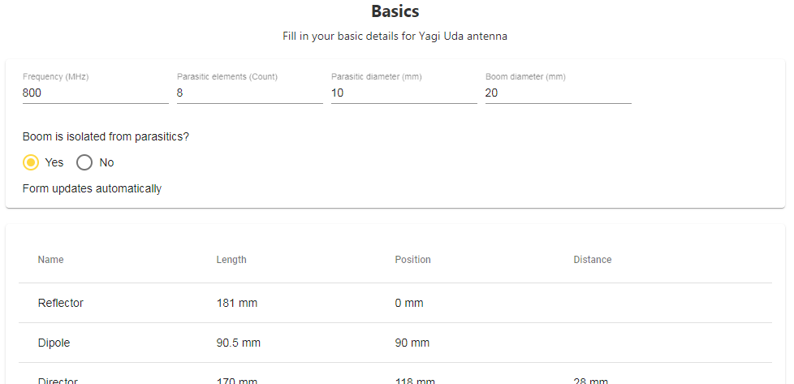
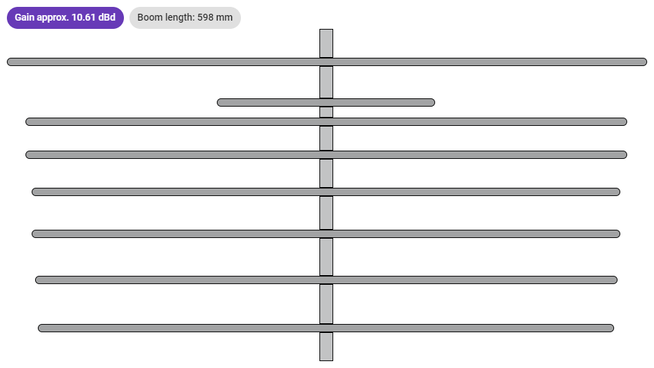

YagiPro
=========

Yagi Uda Pro helps you to calculate Yagi Uda antenna with 3D printable parts.
Specify target **frequency** and other parameters, see build instruction table and 
visualization of antenna design.

  


Table of contents
=================
* [Website](#website)
* [Notes](#notes)
* [Authors](#authors)
* [License](#license)


Website
============

Public production version is available here [YagiPro](https://api.nitramite.com/yagipro/).


Notes
============

###### Run Angular production build locally with
```bash
$ npm prodbuild
```


###### Jenkins build notes

Step 1
```cmd
cd %WORKSPACE%\yagi-pro\
npm install
```

Step 2
```cmd
cd %WORKSPACE%\yagi-pro\
npm install @angular/cli
```

Step 3
```cmd
cd %WORKSPACE%\yagi-pro\
node_modules\.bin\ng build --prod
```

Authors
============

* **Norkator** - *Initial work* - [norkator](https://github.com/norkator)


License
============

<a rel="license" href="http://creativecommons.org/licenses/by-nc-nd/4.0/"></a><br />Licensed with <a rel="license" href="http://creativecommons.org/licenses/by-nc-nd/4.0/">Creative Commons Attribution - NonCommercial - NoDerivatives 4.0 International - license</a>.
